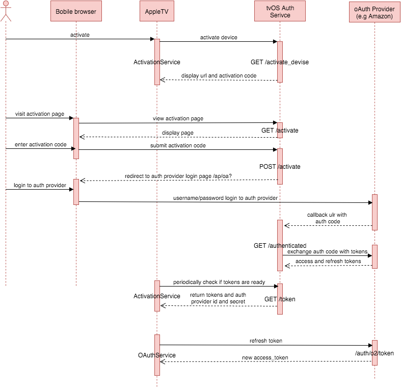

# Remote Authenticator Service for tvOS

Enable users of your tvOS app to authenticate with Amazon (or potentially other oauth services) using an activation code on a mobile or desktop browser.

Comes with docker-compose to easily deploy to any Docker hosting service (e.g AWS or Digital Ocean) 
s

 
## Production deployment

- Setup docker host with docker-machine 
```
    # provision a docker machine on Digital Ocean or AWS
    # https://www.digitalocean.com/community/tutorials/how-to-provision-and-manage-remote-docker-hosts-with-docker-machine-on-ubuntu-16-04
    # example:
    docker-machine create --driver digitalocean --digitalocean-access-token $DOTOKEN tvosauth
    
    # or AWS
    docker-machine create --amazonec2-region us-west-2 --amazonec2-vpc-id vpc-1a745a7f --driver amazonec2 tvosauth
    
    
    # Verify docker machine is running
    docker-machine ls
    
    # Point docker client to the new docker machine 
    docker-machine env tvosauth
    eval $(docker-machine env tvosauth)
    
```


- Set env variables 
    - Rename .env_example to .env and update your production credentials and settings there  
        - AWS_CLIENT_ID: Your Amazon app client id
        - AWS_CLIENT_SECRET: your Amazon app client secret
        - SECRET_KEY: Your own random generated secret key (can use http://www.miniwebtool.com/django-secret-key-generator/)
        - PUBLIC_URL: The public url for your authentication url (e.g. "auth.indiekit.com" )


- Set SSL certificate for https access

    - Create a folder named .ssl under /nginx directory 
    - Copy your SSL certificate file (SSL.crt) and certificate key (server.key) files there  (use the exact file names)


- Run all docker containers 
```
    docker-compose up -d
```

- Run database migrations
	
```
    docker-compose run --no-deps --rm web python migrate.py db upgrade
```  


- Generate api key and secret for your client app  (make sure to copy the key and secret after your run the command)
	
```
    docker-compose run --no-deps --rm web python manage.py create_app --name "CloudPhotos"

```

- You can now use the $PUBLIC_URL/activate with the generated api key and secret in your tvOS app for authentication 
 


## For dev environment setup

- Check [development section](/web/README.md)
